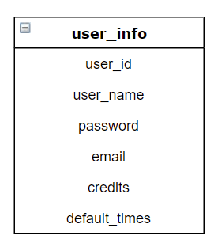
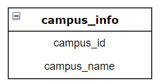
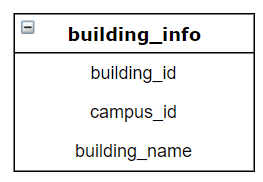
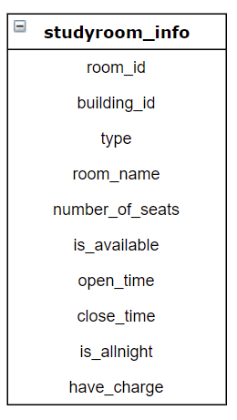
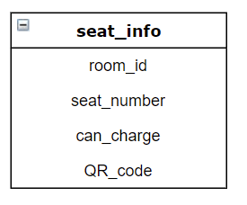
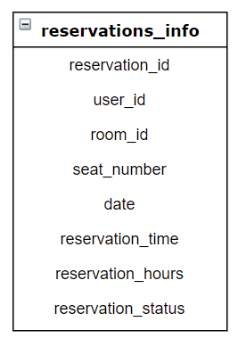

# 一、需求：

为了方便学生自习，学校开放了一批自习室。自习室中的座位利用率不高，经常出现一座难求，同时又有书包占座人却不在的情况。为了提升座位的利用率和周转率，学校一方面考虑动态调整自习室的数量，另一方面也希望采用信息技术手段提升座位的利用率。

通过自习座位预约系统，管理员可以设定可用的自习室以及开放时间。大部分自习室是早7点到晚10点开放（不排除将来有个别教室会通宵开放）。学生则可以查看可用自习室，并预约自习时间。为了提高座位利用率并考虑减少学生连续学习造成的疲劳，每次预约均以整点小时为单位，最多一次性预约4小时（系统参数可调）。

学生按预约到达座位后，最好有签到功能。签到应当需要考虑位置信息，比如用手机小程序或类似机制。引入签到功能后，在预约时间之前15分钟会有推送（邮件推送或微信服务号推送等）提醒；在预约时间之后10分钟如果还未签到，则会再次提醒；预约时间15分钟后如果还未签到，则自动取消预约、释放座位，并提醒学生，同时后台记录一次违约。

在任意一个时间点，如果当前有空闲的座位，学生发现自己就在附近并且希望使用的话，可以马上抢位并根据整点时间段选择使用时间。在有签到功能的情况下，必须在5分钟内签到，从而减少座位资源的浪费。

为了便于使用，学生可以对所需的座位进行搜索，也可以查看历史预定并再次预定该座位。

系统可以增加个性化服务，通过收集预定习惯给用户相应的预定推荐。

管理员通过查看自习室和座位的预约情况来调整管理策略，提升资源利用率。

为了便于学生在线资料获取和学习，靠近固定插座或者移动导轨插座的座位有会有特殊标记，以便学生携带电子设备使用。

每个座位目前都是普通座位，为了便于预约，会给予唯一编号并在桌面进行标记（比如贴一个号码，但目前还没有这个号码，需要自己数第几排哪个座）。未来计划将这个标记做成号码和二维码一体化标签，从而便于预约的学生签到。

另外，为方便留学生使用，希望有多语言的版本，可以便捷切换界面语言。

# 二、数据库设计：

维护六张表：`user_info`,  `campus_info`, `building_info`, `room_info`,  `seat_info`, `reservations_info`

> ### `user_Info`:



`user_id`： 账号，`string`， 25，主键

`user_name`：名称，`string`， 25

`password`：密码，`string`，25

`email`：邮箱，`string`， 25

`credits`：信用值， `int`，大于等于0，默认 100 ，违约一次扣5分，取消一次扣2分，不足60分被禁

`default_times`：违约次数，`int`，大于等于0， 默认0

`is_admin`：是否为管理员，`bool`，默认`false`，注册的均为普通用户

> ### `campus_info`:



`campus_id`: id，主键，校区编码， 比如campus_name为江湾校区，则可设camapus_id为JW。非自动生成    

`campus_name`: 校区名字，`string`， 25

> ### `building_info`:



`building_id`: id, 主键，教学楼编码，非自动生成

`campus_id`: 校区id，外键

`building_name`: 教学楼名称，`string`, 25

> ### `room_info`:



`room_id`：主键，插入时自动生成

`building_id`: 自习室所在教学楼、图书馆id

`type`：自习室类型，`char`，`'1'` 教室自习室 `'2'` 图书馆自习室 `'3'`其他区域自习室

`room_name`：自习室名称，`string`，10

`number_of_seats`：座位数，`int`，大于等于0

`is_available`：自习室是否可用，`bool`，默认 `true`

`open_time`：开放时间，`string`（暂定），比如 `0730`，默认 `0700`

`close_time`：关闭时间，`string`（暂定），默认 `2200`

`is_allnight`：是否通宵，`bool`，默认 `false`

`have_charge`： 充电座位的数量 `int`

> ### `seat_info`:



`seat_id`: 主键，座位唯一标识，插入时自动生成

`room_id`: 自习室id

`seat_number`: 当前自习室的座位序号，`char`，每间自习室座位编号都从1开始

(`room_id`, `seat_number`) 是唯一组合

`can_charge`: 该是否可以充电，`bool`，默认`false`

`QR_code`: 座位二维码，先不考虑，设为`NULL`

> ### `reservation
> 
> ### _info`:



`reservation_id`：主键，自动生成

`user_id`：外键

`room_id`：外键

`seat_id`：外键

`date`：预约日期，`DateField`

`reservation_time` ：预约开始时间，`TimeField`， 大于等于0（整点预约）

`reservation_hours`：预约时长，`DurationField`，大于等于0，小于等于4

`reservation_status`：预约记录状态，`char` ，`0` 未生效，`1`已生效，`2`已取消，`3`已违约，`4`已结束

# 三、座位预约系统功能需求

​    -用户功能：注册、登录、查看所有自习室信息、条件查询符合的自习室、查看历史预约记录

​    -管理员功能需求：登录、管理所有用户信息、自习室信息、以及预约记录信息（CRUD）

​    -系统功能：自动发送邮件、自动更新座位状态、自动检测用户是否违反预约

# 四、核心业务流程：

1. **返回座位状态**：用户登陆系统后，选择心仪自习室进行预约，选择预约开始时间（默认为当前时间后一个小时整点，比如15:35为16:00），此时后端会返回当前自习室的当前时间段的座位预约状态，一个字符串（初定）。字符串中包含大小写字母，大写表示该座位可以充电，小写则反之。此外，字符串共有`a`, `b`, `c`, `d`, `e`及对应大写共10个字符，其中`a`和`A`表示座位不可预约，`b`和`B`表示座位最多可被预约`1`小时（即1小时后有他人已先预约或自习室关闭），`c`和`C`表示座位最多可被预约`2`小时，`d`和`D`表示座位最多可被预约`3`小时，`e`和`E`表示座位最多可被预约`4`小时（至多4小时，因为目前系统规定一次最多预约4小时）。

​        后端返回作为状态流程：根据被选择的自习室，一次查询每个座位的当天的预约记录，得到目前作为的状态，转化为字符。

2. **预约座位**：用户选择好想要预约的座位、预约开始时间，预约时长后，向后端发送预约请求。后端先查询该用户的`credit`，如果不够`60`则返回无法预约。反之，则根据`user_id`查询该用户当天是否有待生效的预约记录，即`reservation_status`是否为`0`，有则返回无法预约，无则返回预约成功，并向`reservations_info`表添加预约记录。
3. **系统在预约前15min发送邮件提醒用户**：系统要在预约时间快到时，自动发送邮件提醒用户，每当整点前`15`分钟，检索`reservations_info`表中预约时间符合且`reservation_status`为`0`的记录，根据`user_id`发送提醒邮件
4. **系统在预约后10min发送邮件提醒用户**：系统要在预约时间到后`10`分钟，向还没有成功签到的用户发送提醒消息。即每当整点过`10`分钟，检索`reservations_info`表中预约时间符合且`reservation_status`为`0`的记录，根据`user_id`发送提醒邮件
5. **系统自动查找违反预约的记录**：每当整点过`15`分钟时，检索`reservations_info`表中预约时间符合且`reservation_status`为`0`的记录，设置`reservation_status`为`3`，并根据`user_id`做出相应惩罚，`default_times`加`1`，`credits`减`10`，并发送提醒消息
6. **系统自动更新预约已完成的记录**：每当整点时，检索`reservations_info`表中预约时间符合（12找（12- `reservation_hours` ））且`reservation_status`为`1`的记录，设置`reservation_status`为`4`
7. **系统推荐功能**：暂不考虑
8. **其他操作**：登陆注册，以及业务层和数据层对六张表的CRUD操作

# 五、接口 `api`文档

#### 登录

------

##### 1) URL

> /login

##### 2) Method: POST

##### 3) 参数

| 字段名称     | 类型     | 必填  | 备注  |
| -------- | ------ | --- | --- |
| user_id  | string | Y   | -   |
| password | string | Y   | -   |

##### 4) 返回结果

```
{
    "success": true
    "code": 200
    "data": [
        "userName": ""
        "credits":
        "defaultTimes":
    ]
}
```

##### 5) 参数说明

`success`：请求是否成功

`code`：消息编号，提供错误信息

#### 注册

------

##### 1) URL

> /register

##### 2) Method: POST

##### 3) 参数

| 字段名称      | 类型     | 必填  | 备注  |
| --------- | ------ | --- | --- |
| user_id   | string | Y   | -   |
| user_name | string | Y   | -   |
| password  | string | Y   | -   |
| email     | string | Y   | -   |

##### 4) 返回结果

```
{
    “success”: true
    “code”:
}
```

##### 5) 参数说明

#### 条件查询自习室信息

------

##### 1) URL

> /studyroom

##### 2) Method: GET

##### 3) 参数

| 字段名称         | 类型     | 必填  | 备注                  |
| ------------ |:------ | --- | ------------------- |
| type         | char   | N   | -                   |
| campus_id    | int    | N   | 查找一个校区的自习室          |
| building_id  | int    | N   | -                   |
| room_name    | string | N   | -                   |
| have_seats   | bool   | N   | 是否有空闲座位             |
| have_charge  | bool   | N   | 是否有可以充电的座位          |
| is_allnight  | bool   | N   | -                   |
| is_available | bool   | Y   | 自习室是否可用，用户默认查询可用自习室 |

##### 4) 返回结果

```
{
    ”success":
    "code":
    "data":
}
```

#### 查找所有校区

------

##### 1) URL

> /campus

##### 2) Method: GET

##### 3) 参数：无

#### 根据校区查找所有教学楼

------

##### 1) URL

> /building

##### 2) Method: GET

##### 3) 参数：

| 字段名称      | 类型  | 必填  | 备注   |
| --------- | --- | --- | ---- |
| campus_id | int | Y   | 校区id |

#### 查看选定时间当前自习室座位状态

------

##### 1) URL

> /studyroom/seatStatus

##### 2) Method: GET

##### 3) 参数

| 字段名称       | 类型  | 必填  | 备注                          |
| ---------- | --- | --- | --------------------------- |
| room_id    | int | Y   | 选择的自习室id                    |
| time_start | int | Y   | 选择查看的时间（15即表示在15:00自习室作为状态） |

##### 4) 返回结果

```
{
    ”success":
    "code":
    "data": 
    //data里存放一段字符串，字符串详细见业务流程1
}
```

#### 删除自习室（管理员）

------

##### 1) URL

> /admin/studyroom/info

##### 2) Method: DELETE

##### 3) 参数

| 字段名称    | 类型  | 必填  | 备注  |
| ------- | --- | --- | --- |
| room_id | int | Y   | -   |

##### 4) 返回结果

```
{
    "success":
    "code":
}
```

#### 修改自习室信息（管理员）

------

##### 1) URL

> /admin/studyroom/info

##### 2) Method: UPDATE

##### 3) 参数

| 字段名称            | 类型     | 必填  | 备注  |
| --------------- | ------ | --- | --- |
| room_id         | int    | Y   | -   |
| type            | char   | N   | -   |
| building_id     | int    | N   | -   |
| number_of_seats | int    | N   | -   |
| room_name       | string | N   | -   |
| is_available    | bool   | N   | -   |
| open_time       | int    | N   | -   |
| close_time      | int    | N   | -   |
| is_allnight     | bool   | N   | -   |

##### 4) 返回结果

```
{
    "success":
    "code":
}
```

#### 添加自习室（管理员）

------

##### 1) URL

> /admin/studyroom/info

##### 2) Method: POST

##### 3) 参数

| 字段名称            | 类型     | 必填  | 备注  |
| --------------- | ------ | --- | --- |
| type            | char   | Y   | -   |
| building_id     | int    | Y   | -   |
| number_of_seats | int    | Y   | -   |
| room_name       | string | Y   | -   |
| is_available    | bool   | N   | -   |
| open_time       | int    | N   | -   |
| close_time      | int    | N   | -   |
| is_allnight     | bool   | N   | -   |

##### 4) 返回结果

```
{
    "success":
    "code":
}
```

#### 预订座位

------

##### 1) URL

> /studyroom/booking

##### 2) Method: POST

##### 3) 参数

| 字段名称              | 类型     | 必填  | 备注      |
| ----------------- | ------ | --- | ------- |
| user_id           | string | Y   | -       |
| room_id           | int    | Y   | -       |
| seat_number       | int    | Y   | 预订第几个座位 |
| reservation_time  | int    | Y   | 预约开始时间  |
| reservation_hours | int    | Y   | 预约时长    |

##### 4) 返回结果

```
{
    "success":
    "code":
}
```

#### 查找某用户今天还未生效的预约记录

------

##### 1) URL

> /reservations/invalid

##### 2) Method: GET

##### 3) 参数

| 字段名称    | 类型     | 必填  | 备注  |
| ------- | ------ | --- | --- |
| user_id | string | Y   | -   |

##### 4) 返回结果

```
{
    "success":
    "code":
    "data":
}
```

#### 取消预约

------

##### 1) URL

> /reservations/cancel

##### 2) Method: PUT

##### 3) 参数

| 字段名称       | 类型 | 必填 | 备注 |
| -------------- | ---- | ---- | ---- |
| reservation_id | int  | Y    | -    |

##### 4) 返回结果

```
{
    "success":
    "code":
}
```

#### 查看历史预约记录

------

##### 1) URL

> /reservations/info

##### 2) Method: GET

##### 3) 参数

| 字段名称    | 类型     | 必填  | 备注  |
| ------- | ------ | --- | --- |
| user_id | string | Y   | -   |

##### 4) 返回结果

```
{
    "success":
    "code":
    "data":[]
}
```

#### 查看所有用户（管理员）

------

##### 1) URL

> /admin/user

##### 2) Method: GET

##### 3) 参数

##### 4) 返回结果

```
{
    "success":
    "code":
    "data":[]
}
```

#### 条件查询用户（管理员）

------

##### 1) URL

> /admin/user/info

##### 2) Method: GET

##### 3) 参数

| 字段名称          | 类型     | 必填  | 备注  |
| ------------- | ------ | --- | --- |
| user_name     | string | N   | -   |
| credits       | int    | N   | -   |
| default_times | int    | N   | -   |

##### 4) 返回结果

```
{
    "success":
    "code":
    "data":[]
}
```

#### 添加用户（管理员）

------

##### 1) URL

> /admin/user/info

##### 2) Method: POST

##### 3) 参数

| 字段名称      | 类型     | 必填  | 备注  |
| --------- | ------ | --- | --- |
| user_id   | string | Y   | -   |
| user_name | string | Y   | -   |
| password  | string | Y   | -   |

##### 4) 返回结果

```
{
    "success":
    "code":
}
```

#### 删除用户（管理员）

------

##### 1) URL

> /admin/user/info

##### 2) Method: DELETE

##### 3) 参数

| 字段名称    | 类型     | 必填  | 备注  |
| ------- | ------ | --- | --- |
| user_id | string | Y   | -   |

##### 4) 返回结果

```
{
    "success":
    "code":
}
```

#### 修改用户（管理员）

------

##### 1) URL

> /admin/user/info

##### 2) Method: UPDATE

##### 3) 参数

| 字段名称          | 类型     | 必填  | 备注  |
| ------------- | ------ | --- | --- |
| user_id       | string | Y   | -   |
| user_name     | string | N   | -   |
| password      | string | N   | -   |
| credits       | int    | N   | -   |
| default_times | int    | N   | -   |

##### 4) 返回结果

```
{
    "success":
    "code":
}
```

#### 查看所有预约记录（管理员）

------

##### 1) URL

> /admin/reservations

##### 2) Method: GET

##### 3) 参数

##### 4) 返回结果

```
{
    "success":
    "code":
    "data":[]
}
```

#### 条件查询预约记录（管理员）

------

##### 1) URL

> /admin/reservations/info

##### 2) Method: GET

##### 3) 参数

| 字段名称               | 类型     | 必填  | 备注  |
| ------------------ | ------ | --- | --- |
| user_id            | string | N   | -   |
| room_id            | int    | N   | -   |
| date               | Date   | N   | -   |
| reservation_time   | int    | N   | -   |
| reservation_status | char   | N   | -   |
| reservation_hours  | int    | N   | -   |

##### 4) 返回结果

```
{
    "success":
    "code":
    "data":[]
}
```

#### 添加预约记录（管理员）

------

##### 1) URL

> /admin/reservations/info

##### 2) Method: POST

##### 3) 参数

| 字段名称               | 类型     | 必填  | 备注  |
| ------------------ | ------ | --- | --- |
| user_id            | string | Y   | -   |
| room_id            | int    | Y   | -   |
| date               | Date   | Y   | -   |
| reservation_time   | int    | Y   | -   |
| reservation_status | char   | Y   | -   |
| seat_number        | int    | Y   | -   |
| reservation_hours  | int    | Y   | -   |

##### 4) 返回结果

```
{
    "success":
    "code":
}
```

#### 删除预约记录（管理员）

------

##### 1) URL

> /admin/reservations/info

##### 2) Method: DELETE

##### 3) 参数

| 字段名称           | 类型  | 必填  | 备注  |
| -------------- | --- | --- | --- |
| reservation_id | int | Y   | -   |

##### 4) 返回结果

```
{
    "success":
    "code":
}
```

#### 修改预约记录（管理员）

------

##### 1) URL

> /admin/reservations/info

##### 2) Method: UPDATE

##### 3) 参数

| 字段名称               | 类型     | 必填  | 备注  |
| ------------------ | ------ | --- | --- |
| reservation_id     | int    | Y   | -   |
| user_id            | string | N   | -   |
| room_id            | int    | N   | -   |
| date               | Date   | N   | -   |
| reservation_time   | int    | N   | -   |
| reservation_status | char   | N   | -   |
| seat_number        | int    | N   | -   |
| reservation_hours  | int    | N   | -   |

##### 4) 返回结果

```
{
    "success":
    "code":
}
```

#### 添加校区（管理员）

------

##### 1) URL

> /admin/campus/info

##### 2) Method: POST

##### 3) 参数

| 字段名称        | 类型     | 必填  | 备注  |
| ----------- | ------ | --- | --- |
| campus_name | string | Y   | -   |

##### 4) 返回结果

```
{
    "success":
    "code":
}
```

#### 删除校区（管理员）

------

##### 1) URL

> /admin/campus/info

##### 2) Method: DELETE

##### 3) 参数

| 字段名称      | 类型  | 必填  | 备注  |
| --------- | --- | --- | --- |
| campus_id | int | Y   | -   |

#### 修改校区（管理员）

------

##### 1) URL

> /admin/campus/info

##### 2) Method: UPDATE

##### 3) 参数

| 字段名称        | 类型     | 必填  | 备注  |
| ----------- | ------ | --- | --- |
| campus_id   | int    | Y   | -   |
| campus_name | string | Y   | -   |

#### 查找所有校区（管理员）

------

##### 1) URL

> /admin/campus/info

##### 2) Method: GET

#### 添加building（管理员）

------

##### 1) URL

> /admin/buildings/info

##### 2) Method: POST

##### 3) 参数

| 字段名称          | 类型     | 必填  | 备注  |
| ------------- | ------ | --- | --- |
| campus_id     | int    | Y   | -   |
| building_name | string | Y   | -   |

##### 4) 返回结果

```
{
    "success":
    "code":
}
```

#### 删除building（管理员）

------

##### 1) URL

> /admin/buildings/info

##### 2) Method: DELETE

##### 3) 参数

| 字段名称        | 类型  | 必填  | 备注  |
| ----------- | --- | --- | --- |
| building_id | int | Y   | -   |

#### 修改building（管理员）

------

##### 1) URL

> /admin/buildings/info

##### 2) Method: UPDATE

##### 3) 参数

| 字段名称          | 类型     | 必填  | 备注  |
| ------------- | ------ | --- | --- |
| campus_id     | int    | N   | -   |
| building_id   | int    | Y   | -   |
| building_name | string | N   | -   |

#### 查找所有building（管理员）

------

##### 1) URL

> /admin/buildings/info

##### 2) Method: GET

#### 添加座位（管理员）

------

##### 1) URL

> /admin/seat/info

##### 2) Method: POST

##### 3) 参数

| 字段名称        | 类型     | 必填  | 备注       |
| ----------- | ------ | --- | -------- |
| room_id     | string | Y   | -        |
| seat_number | int    | Y   | -        |
| can_charge  | bool   | N   | 默认为false |
| QR_code     | string |     | 暂不考虑     |

#### 删除座位（管理员）

------

##### 1) URL

> /admin/seat/info

##### 2) Method: DELETE

##### 3) 参数

| 字段名称        | 类型     | 必填  | 备注  |
| ----------- | ------ | --- | --- |
| room_id     | string | Y   | -   |
| seat_number | int    | Y   | -   |

#### 修改座位（管理员）

------

##### 1) URL

> /admin/seat/info

##### 2) Method: DELETE

##### 3) 参数

| 字段名称        | 类型     | 必填  | 备注   |
| ----------- | ------ | --- | ---- |
| room_id     | string | Y   | -    |
| seat_number | int    | Y   | -    |
| can_charge  | bool   | N   | -    |
| QR_code     |        |     | 暂不考虑 |

#### 条件查看某教室所有座位（管理员）

------

##### 1) URL

> /admin/seat/info

##### 2) Method: GET

##### 3) 参数

| 字段名称       | 类型     | 必填  | 备注  |
| ---------- | ------ | --- | --- |
| room_id    | string | Y   | -   |
| can_charge | bool   | N   | -   |

//暂定，待补充......

`Code`值具体含义

100 成功

201 用户登陆失败：未查找到此id

202 用户登陆失败：密码错误

301 注册失败：id重复

401 预约座位失败：信用值不及格

402 预约座位失败：座位已被预定

403 预约座位失败：预约时间过长

501 添加用户失败，id重复

600 连接数据库失败，请重试

700 取消预约失败：该预约记录不存在

701 取消预约失败：该预约已生效

702 取消预约失败：该预约已取消

703 取消预约失败：该预约已违约

704 取消预约失败：该预约已结束

801 签到失败：该预约记录不存在

802 签到失败：该预约已生效

803 签到失败：该预约已取消

804 签到失败：该预约已违约

805 签到失败：该预约已结束